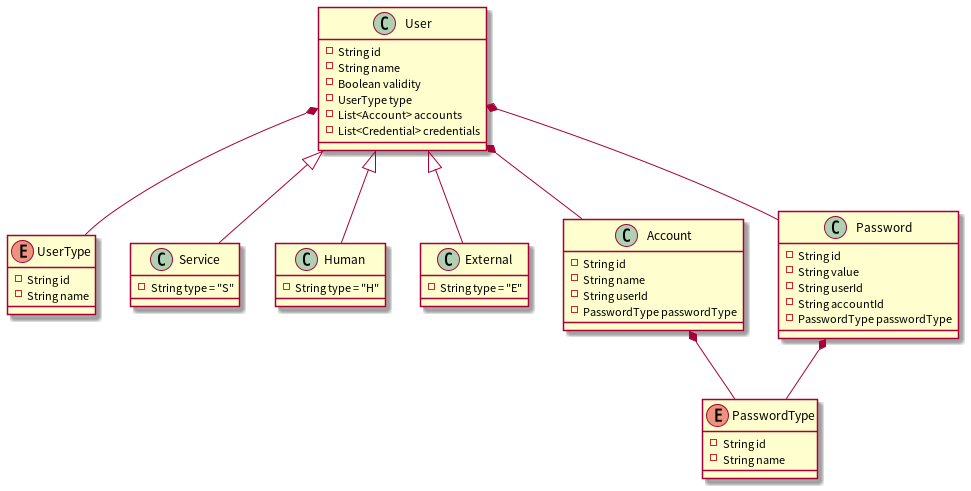
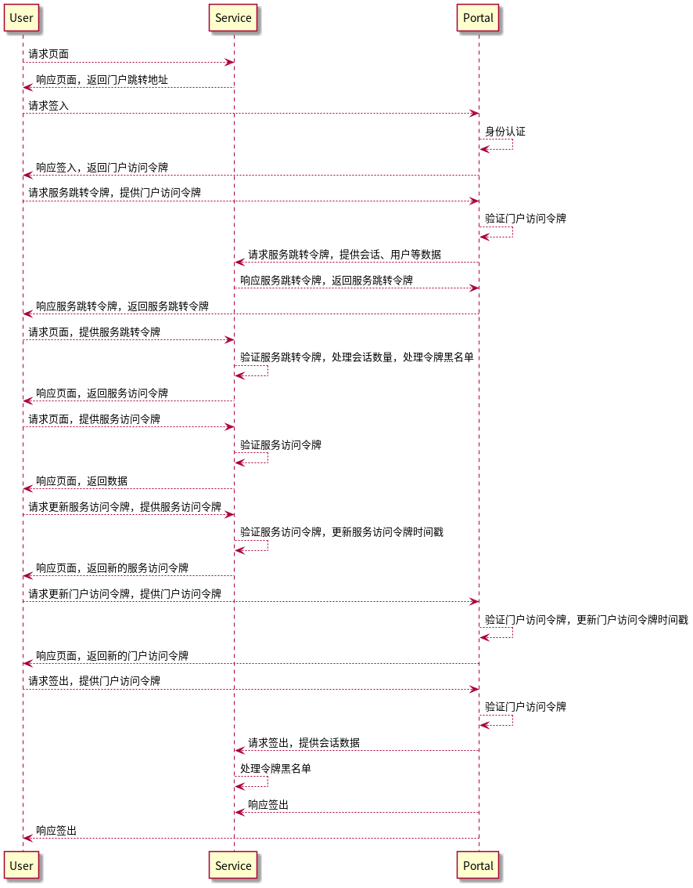
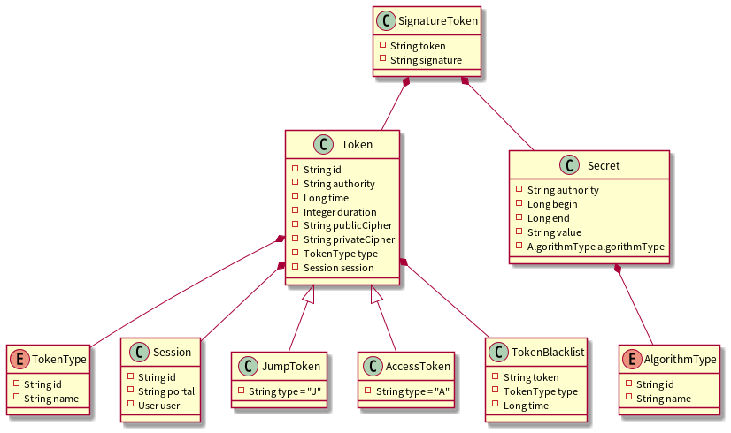
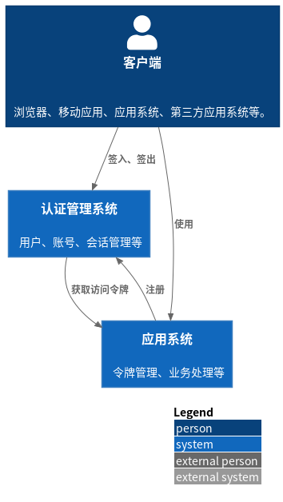

# 认证管理

## 需求明细

- 用户管理
  - 新增
  - 修改
  - 启用
  - 禁用
  - 获取
  - 列表
- 账户管理
  - 新增
  - 修改
  - 删除
  - 获取
  - 列表
- 应用管理
  - 新增
  - 修改
  - 删除
  - 获取
  - 列表
- 会话管理
  - 统一签入
  - 统一签出
  - 会话数量
  - 无状态
  - 实时终止
  - 应用间访问

## 需求分析

用户包括人、服务、外部服务三种类型。

账号和密码匹配，先匹配用户编号和账号编号一致的密码，即不同的帐户可以使用不同的密码。如果密码不存在，再匹配用户编号和密码类型一致的密码，即不同的帐户可以使用相同的密码。

令牌需要在加密链路上传输，因为URL无法加密，因此引入跳转令牌，跳转令牌为一次性令牌，只能验证一次。

一次会话可以有多个令牌，会话由门户统一管理，令牌由服务自行管理。

令牌由服务签名后发给客户端，然后通过验证签名是否有效验证令牌。令牌中需要加密的内容分为公开和私有，公开内容使用门户提供的密钥和算法进行加密，私有内容使用服务自己的方式加密。

令牌验证还包括签发机构、时间有效性、令牌黑名单等。

## 系统架构

## 详细设计

直接在源码中构思控制器接口。
