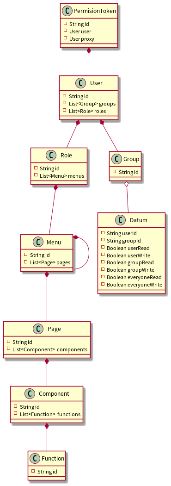

# 授权管理

## 需求明细

- 角色管理
  - 新增
  - 修改
  - 删除
  - 获取
  - 列表
- 组管理
  - 新增
  - 修改
  - 删除
  - 获取
  - 列表
- 接口管理
  - 新增
  - 修改
  - 删除
  - 获取
  - 列表
- 页面管理
  - 新增
  - 修改
  - 删除
  - 获取
  - 列表
- 页面组件管理
  - 新增
  - 修改
  - 删除
  - 获取
  - 列表
- 菜单管理
  - 新增
  - 修改
  - 删除
  - 获取
  - 列表
- 授权管理
  - 功能授权
  - 数据授权
  - 权限代理

## 需求分析

通过角色授权用户可以使用哪些功能。

通过组授权用户可以读写哪些数据。

## 详细设计

直接在源码中构思控制器接口。
